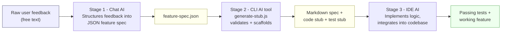

# Multi-Stage AI Workflow Across UX Types

A working, end-to-end demonstration of an AI workflow that chains three
different AI UX types to turn a messy user complaint into a tested,
integrated code feature — **Chat → CLI → IDE**.

## Table of Contents

1. The Problem
2. Tools Used
3. Workflow Diagram
4. Step-by-Step Walkthrough
5. How to Run It Yourself
6. Adaptability Notes
7. Efficiency Notes

---

## 1. The Problem

TaskFlow (the fictional app used elsewhere in this course) receives raw,
unstructured user feedback. Turning a sentence like *"tell me how many
tasks are overdue"* into a shipped, tested feature normally means a person
manually: reads the feedback, writes a spec, scaffolds the code and tests,
then implements and verifies it. This workflow automates that hand-off
chain across three AI tools so each stage's output becomes the next
stage's input, with a human only reviewing at the boundaries.

Feature chosen: **Overdue Task Reminders** — a small, self-contained
enough feature to implement and test fully within this exercise, but
realistic enough to show a genuine spec → stub → implementation chain.

---

## 2. Tools Used

The workflow is tool-agnostic — any tool in each category works:

| Stage | UX Type | Example tools | Role |
|---|---|---|---|
| 1 | **Chat** | ChatGPT, Claude.ai, Gemini Chat | Turns messy natural-language feedback into a structured JSON feature spec |
| 2 | **CLI** | Claude Code CLI, Gemini CLI | Reads the JSON spec, validates it, and generates a Markdown spec doc plus code/test stubs |
| 3 | **IDE** | VS Code + Copilot, Claude Code (IDE extension) | Reads the stubs, implements the logic, integrates it into the codebase, and runs the tests |

---

## 3. Workflow Diagram



Each arrow is a real file boundary in this repo — nothing here is
hypothetical. `feature-spec.json` and the generated stub files are the
literal artifacts passed between stages.

---

## 4. Step-by-Step Walkthrough

### Stage 1 — Chat AI ([`stage1-chat/`](./stage1-chat/))

1. A user's raw feedback is captured in [`raw-feedback.txt`](./stage1-chat/raw-feedback.txt).
2. That text is pasted into a chat-based AI with the prompt in
   [`chat-prompt-and-response.md`](./stage1-chat/chat-prompt-and-response.md),
   asking for a structured spec (`feature_name`, `description`,
   `user_story`, `acceptance_criteria`, `priority`).
3. The structured response is saved as [`feature-spec.json`](./stage1-chat/feature-spec.json)
   — this is the hand-off artifact to Stage 2.

### Stage 2 — CLI AI tool ([`stage2-cli/`](./stage2-cli/))

1. [`generate-stub.js`](./stage2-cli/generate-stub.js) reads `feature-spec.json`
   and validates that every required field is present.
2. It generates three files into `stage2-cli/output/`:
   - a Markdown feature-spec document with a checklist of acceptance criteria
   - a JS function stub (`getOverdueTaskReminders.js`) with one TODO comment
     per acceptance criterion
   - a matching test-file skeleton
3. Run it with:
   ```bash
   cd stage2-cli
   node generate-stub.js
   ```
   Actual output from this run:
   ```
   [stage2-cli] Reading spec from .../stage1-chat/feature-spec.json
   [stage2-cli] Spec valid ✔ (4 acceptance criteria)
   [stage2-cli] Wrote feature spec  -> output\overdue-task-reminders.md
   [stage2-cli] Wrote code stub     -> output\getOverdueTaskReminders.js
   [stage2-cli] Wrote test stub     -> output\getOverdueTaskReminders.test.js
   [stage2-cli] Done. Hand these files to Stage 3 (IDE AI) for implementation.
   ```

### Stage 3 — IDE AI ([`stage3-ide/`](./stage3-ide/))

1. The stub files from Stage 2 are opened in the IDE. The IDE-based AI
   fills in the TODOs, turning the throwing stub into a real
   implementation: [`getOverdueTaskReminders.js`](./stage3-ide/getOverdueTaskReminders.js).
2. The test skeleton is completed with one real assertion per acceptance
   criterion: [`getOverdueTaskReminders.test.js`](./stage3-ide/getOverdueTaskReminders.test.js).
3. The feature is wired into a small existing codebase
   ([`taskManager.js`](./stage3-ide/taskManager.js) + [`index.js`](./stage3-ide/index.js))
   to prove real integration, not just an isolated function.
4. Tests are run directly from the IDE's integrated terminal:
   ```bash
   cd stage3-ide
   node getOverdueTaskReminders.test.js
   ```
   Actual output:
   ```
   getOverdueTaskReminders
     ok - counts a past-due, not-done task as overdue
     ok - does not count a past-due task that is already done
     ok - badge text includes the overdue count
     ok - badge is null when there are no overdue tasks
     ok - count updates after a task's status changes to done

   All tests passed.
   ```

---

## 5. How to Run It Yourself

```bash
# Stage 2: regenerate the stubs from the chat-AI spec
cd multi-stage-ai-workflow/stage2-cli
node generate-stub.js

# Stage 3: run the finished implementation's tests
cd ../stage3-ide
node getOverdueTaskReminders.test.js

# Stage 3: see the feature working against sample data
node index.js
```

No dependencies or API keys are required — every script runs on plain
Node.js, so the workflow is reproducible without installing anything
beyond a JavaScript runtime.

---

## 6. Adaptability Notes

- **Stage 1** only needs a chat interface that can follow a
  "structure this into JSON" instruction — ChatGPT, Claude.ai, and Gemini
  Chat are interchangeable here.
- **Stage 2** depends only on Node.js and a JSON file with the five
  expected fields — it has no dependency on which chat tool produced the
  JSON, or which CLI AI tool is used to run/review it.
- **Stage 3** depends only on the stub files existing on disk — any
  IDE-integrated AI (Copilot, Claude Code, Cursor, etc.) can open them and
  complete the implementation the same way a human developer would.
- The only "contract" between stages is the shape of `feature-spec.json`
  and the generated stub files — swap any tool in any stage without
  changing the others.

---

## 7. Efficiency Notes

Manual effort this workflow removes:

- No manual re-typing of feedback into a spec format — Stage 1 does this
  in one prompt.
- No manual file/boilerplate creation — Stage 2 generates the doc, code
  stub, and test skeleton in under a second, already named and structured
  consistently.
- Stage 3's job shrinks from "build everything from scratch" to "fill in
  TODOs and wire it up," which is faster and less error-prone than
  starting from a blank file.

Result: raw feedback → a running, tested feature with three short,
reviewable hand-offs instead of one long unstructured task.
